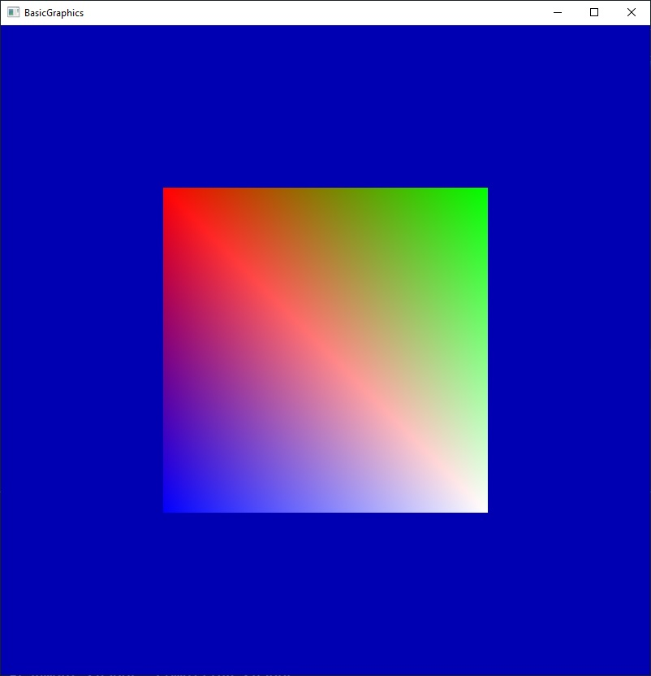

BasicGraphics
Programmed and Taught by Professor Reale at SUNY Polytechnic Institute

Modifications and assignments done by Patrick Farrell
This was the main project worked on during CS450 Computer Graphics in Spring 2022
=============

This is a very basic OpenGL sample for use in SUNY Polytechnic Institute's CS 450/548 Computer Graphics course.  

## Dependencies

The following dependencies need to be installed:

- OpenGL
- GLFW
- GLEW
- GLM
- Assimp
- stb_image
- stb_image_write

See [here](https://web.cs.sunyit.edu/~realemj/guides/installGraphics.html) for further instructions.

## Debugging

In the main() function, there is a variable DEBUG_MODE, which defaults to true.

Amongst other things, this will ensure an OpenGL debug context is created, which as the name implies makes debugging your program easier.  However, it also slows down performance. 

## OpenGL and GLSL Version

By default, the program will attempt to create an OpenGL context of version 4.3:

```c++
GLFWwindow* window = setupGLFW(4, 3, 800, 800, DEBUG_MODE);
```

If you encounter issues (in particular, if your graphics hardware does not support version 4.3), contact me, as you will also have to change the first line of Basic.vs and Basic.fs:

```glsl
#version 430 core
```

## Running the Program

In brief, the sample:

1. Initializes GLFW, creating a window of size 800 x 800 with an OpenGL context of version 4.3.

2. Initializes GLEW.

3. Prints out the OpenGL and GLSL versions.

4. (Debugging mode) Set up OpenGL context debugging.

5. Sets background color to a shade of blue.

6. Loads vertex and fragment shader code from Basic.vs and Basic.fs.

7. (Debugging mode) Prints shader code.

8. Creates a shader program from loaded code.

9. Creates a simple quad (4 vertices, 6 indices, 2 triangles).  

   * The vertices stored are (0) upper left, (1) upper right, (2) lower left, and (3) lower right.
   * The colors of the vertices are (0) red, (1) green, (2) blue, and (3) white (in that order).
   * The indices of the two triangles are (0, 3, 1) and (0, 2, 3).

10. Creates an OpenGL mesh (VBO, EBO, and VAO) from the quad data.

11. Enables depth testing.

12. While the window is still open:

    * Get the current frame buffer size and set the viewport accordingly.

    * Clear the color and depth buffers.
    * Activate the shader program.
    * Draw the OpenGL mesh.
    * Swap the buffers.
    * Poll for (window, keyboard, mouse) events.
    * Sleep for 15 milliseconds.

13. Clean up OpenGL mesh.

14. Deactivate the shader and delete it.

15. Clean up the window and GLFW.


While the program is running, you should see the following window:




